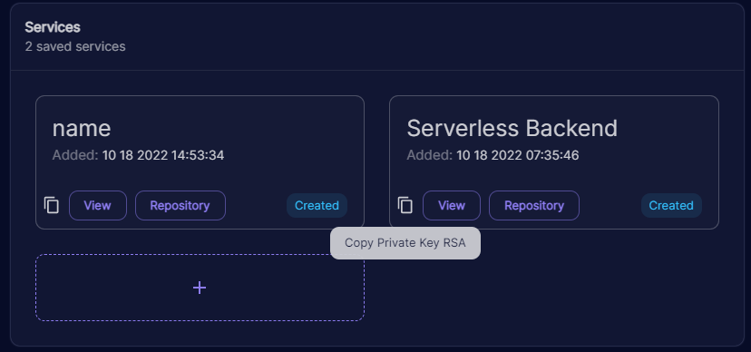
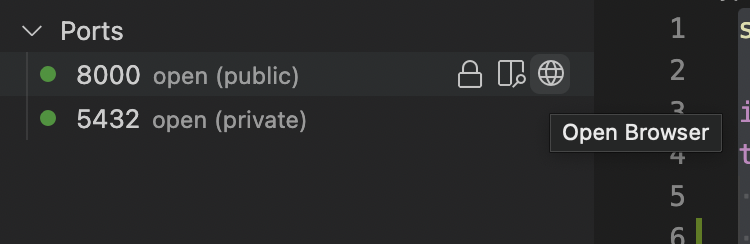

# {{ cookiecutter.project.name }}  

This project was generated using the Django Template of the ProcessBP Project. Below you'll find detailed instructions on how to effectively use this repo for building django REST APIs.

# Getting Started

It is recommended to use Devspaces for development with this template as it uses `gitpod.yml` file for an automatic setup.
1. Open a Devspaces workspace for the generated repo.
2. Copy the Private RSA Key for the service from your project's details page.

3. Enter the RSA key in Devspaces terminal and then hit enter twice.
4. Fill the values corresponding to the [required environment variables](./env/.env.dev.template).
5. Your Django application will now be up and running. 

`Note: If for whatever reason you wish to kill and restart the app use the following command to run it again`
```commandline
docker-compose up
```



`Note: The recommended way of running the app is using docker containers. If you are running the app on legacy devspaces or on a local machine with an x86 chip, you will need to modify the mysql image in docker-compose.yml which is configured for ARM`

```yml
mysql:
    image: mysql:latest
```



6. To view the django server, make port 8000 public in devspaces and open devspaces URL in the browser


`Entering the RSA key and environment variable values needs to be done in first time setup only.`

## Documentation
Refer the following documentationa for specific features of the template:
- [Navigating the Project](docs/project_structure.md)
- [Environment and Secrets management](docs/env_management.md)

- [Swagger](docs/swagger.md)


- [Rest Authentication](docs/rest_authentication.md)


- [Social Authentication](docs/social_authentication.md)


- [Database Integration](docs/databases.md)



- [Deployment](docs/deployment.md#eyk-deployment)

- [Deployment](docs/deployment.md#cdk-deployment)



- [Debugging on VS Code](docs/debugger.md)


- [Linter](docs/linter.md)


- [Customized Logger](docs/logging.md)



Learn more about the template:

- [Template Docs](docs)

- [DRF Docs](https://www.django-rest-framework.org/)

- [Django Docs](https://www.djangoproject.com/)
