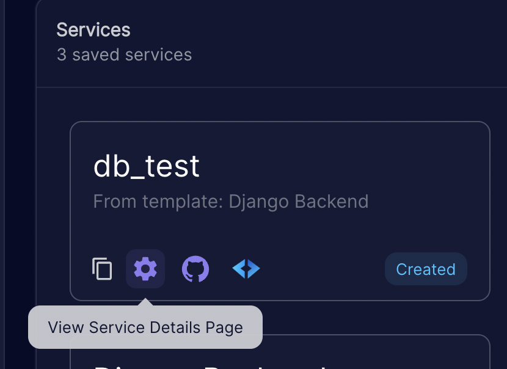
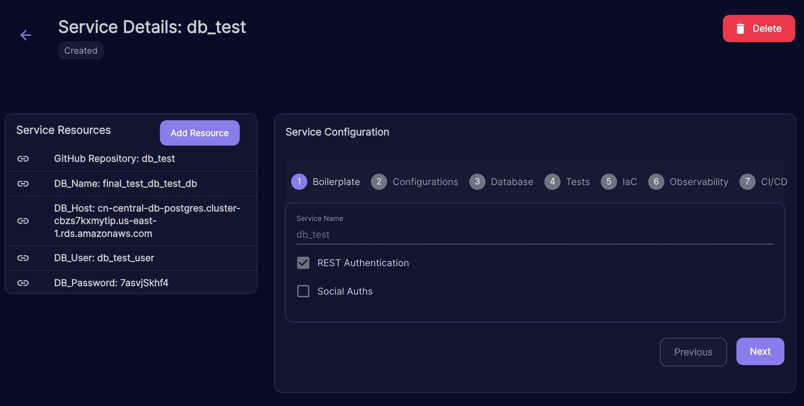

# Databases
When you choose to create a database in your service configuration, process bp creates a new db and user with access to that DB in the selected database engine (either MySQL or PostgreSQL)

### PostgreSQL connection settings

```json
DB_ENGINE = django.db.backends.postgresql
DB_NAME = postgres
DB_USER = user
DB_PASSWORD = password
DB_HOST = localhost
DB_PORT = 5432
```

### MySQL 

#### Note

When using Docker Compose on non arm architectures, you need to use the mysql:5.7 image instead of arm64v8/mysql

#### Connection settings

```json
DB_ENGINE = django.db.backends.mysql
DB_NAME = mysql
DB_USER = user
DB_PASSWORD = password
DB_HOST = localhost
DB_PORT = 3306
```

You can get the required credentials and database name for your created database by going to the service details 


And checking the service resources table



