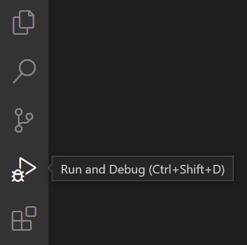
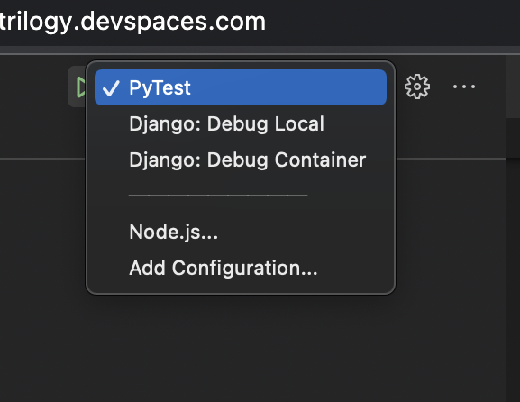
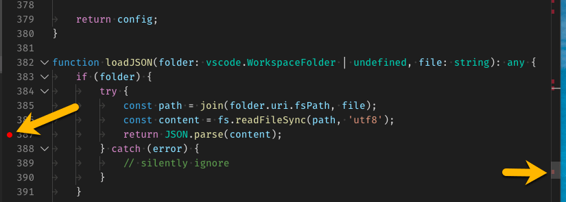
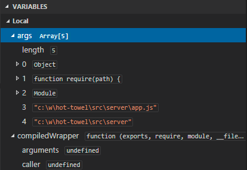

## Local Debugger

### Run and Debug view
To bring up the Run and Debug view, select the Run and Debug icon in the Activity Bar on the side of VS Code. You can also use the keyboard shortcut ⇧⌘D.

### Preconfigured Debuggers
You will see two preconfigured debugger options to debug your code

Debug Container is of type attach, that is, it attaches a debugger to an already running container. Therefor, launch this when you have a running container with docker-compose

Debug local is of type launch, that is, it launches a new django server. Therefore, use this when you want to run a new django server on port 8000 on the host machine itself. Note that, this will fail if you already have another django server running on port 8000

### Debug actions

Once a debug session starts, the Debug toolbar will appear on the top of the editor.

- Continue / Pause F5
- Step Over F10
- Step Into F11
- Step Out ⇧F11
- Restart ⇧⌘F5
- Stop ⇧F5

### Breakpoints

Breakpoints can be toggled by clicking on the editor margin or using F9 on the current line. Finer breakpoint control (enable/disable/reapply) can be done in the Run and Debug view's BREAKPOINTS section.

- Breakpoints in the editor margin are normally shown as red filled circles.
- Disabled breakpoints have a filled gray circle.
- When a debugging session starts, breakpoints that cannot be registered with the debugger change to a gray hollow circle. The same might happen if the source is edited while a debug session without live-edit support is running.

If the debugger supports breaking on different kinds of errors or exceptions, those will also be available in the BREAKPOINTS view.

### Data inspection
    
Variables can be inspected in the **VARIABLES** section of the **Run and Debug** view or by hovering over their source in the editor. Variable values and expression evaluation are relative to the selected stack frame in the **CALL STACK** section.

Variable values can be modified with the Set Value action from the variable's context menu. Additionally, you can use the Copy Value action to copy the variable's value, or Copy as Expression action to copy an expression to access the variable.

Variables and expressions can also be evaluated and watched in the Run and Debug view's WATCH section.

[More Details](https://code.visualstudio.com/docs/editor/debugging)