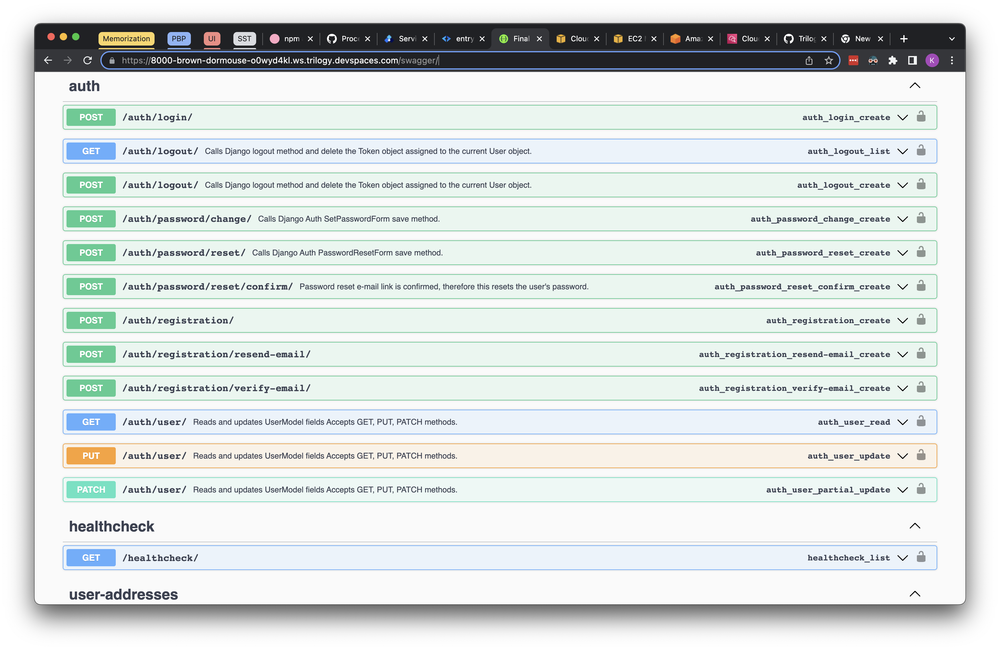

# Swagger Generator

Swagger is automatically generated for the project using django-yasg package
Once the django server is up, you can simply navigate to  `<server-url>/swagger` to see the generated swagger

